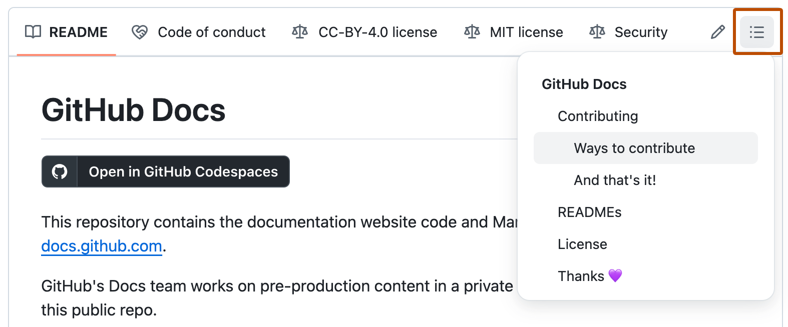

+++
title = "如何在 README.md 明確區分網站程式碼與論文授權"
description = "建立網站宣傳論文時，README.md 必須清楚區分程式碼開源授權與論文專有權利。本文提供結構化範例與撰寫重點，協助你避免法律爭議。讓專案參與者與使用者都能明確理解各自權利與義務。"
date = "2025-08-01T16:07:43Z"
updated = "2025-08-02T14:45:15.702Z"
draft = false

[taxonomies]
tags = [ "License" ]
providers = [ "Felo Search" ]

[extra]
withAI = "<https://felo.ai/search/JSUNwNQkYb2cqqUjdAr7pF?invite=dOLYGeJyZJqVX>"
+++

我在 GitHub 上建立了一個網站，用來宣傳一個論文發現。我受到論文作者的委託建立此網站。網站本身的程式碼以 AGPLv3 開源，但是論文和其技術由論文作者保留所有權利。請問我如何正確的在 README.md 撰寫 licence 介紹以傳達這件事情? 其論文位置在此: <https://vixra.org/abs/2412.0035>



好的，這是一份關於如何在您的 GitHub `README.md` 檔案中，正確且清晰地闡述網站程式碼與其宣傳之科學論文之間複合式智慧財產權狀態的研究報告。


本報告旨在提供一份詳盡的指南，說明如何在 GitHub 專案的 `README.md` 檔案中，清晰地區分開源軟體授權（GNU Affero General Public License v3.0）與受版權保護之學術內容（科學論文及其發現）的法律狀態。核心挑戰在於避免法律模糊性，確保使用者、潛在貢獻者與技術採用者能準確理解其權利與義務。最佳實踐是建立一個專門的「授權與智慧財產權」區塊，明確界定 AGPLv3 授權僅適用於網站的實作程式碼，而論文及其核心技術的版權則由原作者完全保留。透過精確的措辭、清晰的結構以及善用 Markdown 格式化功能，可以有效傳達此一重要的法律區隔，從而保護專案各方的權益。

## README.md 的核心作用與重要性

### 專案的第一印象

`README.md` 檔案通常是訪客在瀏覽 GitHub 儲存庫時看到的第一份文件 [^9][^18][^77]。它扮演著介紹與解釋專案的角色，提供理解專案所需的基本資訊 [^11][^81][^108]。一份高品質的 `README.md` 對於專案的成功至關重要，它不僅能吸引使用者與潛在貢獻者，更是建立專案專業形象的基石 [^9][^31][^109]。當訪客進入您的儲存庫時，`README.md` 就是您的專案「門面」[^7][^79]。

### 法律與合規性的基礎

在 `README.md` 中清楚地聲明授權條款，是一項廣泛認可的最佳實踐 [^107]。若未提供任何授權，預設的版權法將適用，這意味著您保留所有權利，他人不得複製、散布或建立衍生作品 [^107]。這會嚴重阻礙開源協作。因此，在 `README.md` 中加入授權聲明，或直接連結到儲存庫中的 `LICENSE` 檔案，能幫助潛在的貢獻者和使用者了解他們在法律上可以做什麼，以及他們應盡的義務 [^4][^73][^96]。

## 處理複合式智慧財產權情境

### 問題定義：程式碼與內容的分離

您的專案面臨一個常見但關鍵的挑戰：網站的實作程式碼採用了開源的 AGPLv3 授權，而其所展示和宣傳的科學論文內容及其技術發現，則屬於版權所有者保留所有權利的專有智慧財產。這兩種不同的法律狀態必須被明確區分，以避免使用者誤解 AGPLv3 授權範圍涵蓋了論文本身。

### GNU Affero General Public License v3.0 (AGPLv3) 的核心要求

AGPLv3 是一種「強力著作傳式 (strong copyleft)」授權條款，專為網路伺服器軟體設計 [^48][^51][^63]。其最顯著的特點是解決了傳統 GPL 授權中的「應用服務供應商 (ASP) 漏洞」[^48][^130]。

* **網路服務條款**：若您修改了受 AGPLv3 授權的程式碼，並透過網路（例如您的網站）向使用者提供服務，您必須將修改後版本的完整原始程式碼，以同樣的 AGPLv3 授權提供給所有使用者 [^50][^55][^131]。
* **傳染性**：任何基於 AGPLv3 程式碼建立的衍生作品，其整體也必須採用 AGPLv3 授權 [^55]。這使得明確界定「作品」的邊界變得至關重要。在您的情境中，「作品」僅指網站程式碼，而不包含論文內容。
* **使用者義務**：使用 AGPLv3 授權的程式碼時，必須保留原始的版權聲明、提供完整的授權條款文字，並在修改時明確標示變更之處 [^130][^131]。


## 撰寫 README.md 的最佳實踐

### 建立清晰的結構

一份優秀的 `README.md` 應具備邏輯清晰的結構 [^109]。使用二級標題 (`##`) 來劃分主要的區塊，例如「專案介紹」、「安裝指南」和「授權」等 [^1][^12]。當 `README.md` 檔案包含兩個或更多標題時，GitHub 會自動在檔案標頭處產生一個目錄，方便使用者快速導覽至感興趣的區塊 [^1]。



### 關鍵區塊：授權與智慧財產權

為了處理您專案的特殊情況，強烈建議建立一個獨立且標題明確的區塊。以下是一個結構化的範例，您可以直接採用或修改。

```markdown
## 授權與智慧財產權 (License and Intellectual Property)

本專案的智慧財產權結構分為兩個獨立部分，各自適用不同的授權與版權規範。請務必仔細閱讀。

## 1. 網站原始程式碼 (Website Source Code)

本儲存庫中包含的所有用於建構、執行和展示此網站的原始程式碼（例如 HTML, CSS, JavaScript, 以及後端邏輯等），皆根據 **GNU Affero General Public License v3.0 (AGPLv3)** 進行授權。

*   您可以在儲存庫根目錄的 [`LICENSE`](./LICENSE) 檔案中找到完整的 AGPLv3 授權條款。
*   根據 AGPLv3 的規定，任何對本網站程式碼的修改，若透過網路提供服務，其修改後的完整原始程式碼也必須以 AGPLv3 授權向使用者公開。

## 2. 科學論文與其技術發現 (Scientific Paper and its Findings)

> [!WARNING]
> **請特別注意**：上述的 AGPLv3 授權 **不適用於** 以下所提及的科學論文及其內容。

本網站所宣傳的科學論文及其所有相關的智慧財產權，由其原作者保留所有權利 (All Rights Reserved)。

*   **論文標題**：*Electra-electric induction (EEI) and its application*
*   **論文作者**：[請填寫論文作者姓名]
*   **版權所有**：Copyright &copy; [論文發表年份] [請填寫論文作者姓名]. All Rights Reserved.
*   **論文連結**：[https://vixra.org/abs/2412.0035](https://vixra.org/abs/2412.0035)

未經論文版權持有人（即論文作者）的明確書面授權，**嚴禁** 將該論文的內容、理論、公式、數據或其核心技術發現用於任何商業目的，或基於其內容建立任何形式的衍生作品。本網站僅作為宣傳與資訊展示之用。

## 3. 總體版權聲明 (Overall Copyright Notice)

*   **網站程式碼**：Copyright &copy; 2025 [您的姓名或組織名稱]. Licensed under the AGPLv3.
*   **學術內容**：Copyright &copy; [論文發表年份] [論文作者姓名]. All Rights Reserved.
```

### 使用 Markdown 語法增強可讀性

為了讓重要的法律資訊更加醒目，您可以善用 GitHub Flavored Markdown 的多種格式化工具：

* **粗體與斜體**：使用 `**粗體**` 或 `*斜體*` 來強調關鍵字詞，例如 `**不適用於**` [^1][^75]。
* **引用區塊**：使用 `>` 來建立引用區塊，使特定段落更加突出 [^12]。
* **提示框 (Alerts)**：GitHub 支援特殊的提示框語法，能以不同顏色和圖示來強調資訊的重要性。`[!WARNING]` 或 `[!NOTE]` 是非常有效的工具 [^1]。

下表總結了常用的文字樣式語法：

| 樣式 | 語法 | 範例 | 輸出 |
| --- | --- | --- | --- |
| 粗體 | `** **` 或 `__ __` | `**重要通知**` | **重要通知** |
| 斜體 | `* *` 或 `_ _` | `_請注意_` | _請注意_ |
| 刪除線 | `~~ ~~` | `~~舊資訊~~` | ~~舊資訊~~ |
| 程式碼片段 | `` ` `` | `` `LICENSE` `` | `LICENSE` |

## 完整的 README.md 範例模板

以下提供一份完整的 `README.md` 模板，您可以根據專案的具體情況進行修改。

```markdown
# [專案標題] - [論文核心發現的簡短描述]

 

本網站旨在宣傳與介紹 [論文作者姓名] 的開創性研究成果：[論文標題]。我們透過此平台提供論文的相關資訊與連結，促進學術交流與討論。

## 專案背景

[此處可以簡要說明建立此網站的動機，以及該科學發現的重要性。]

## 核心論文資訊

*   **論文標題**: *Electra-electric induction (EEI) and its application*
*   **作者**: [論文作者姓名]
*   **論文連結**: [https://vixra.org/abs/2412.0035](https://vixra.org/abs/2412.0035)

## 授權與智慧財產權 (License and Intellectual Property)

本專案的智慧財產權結構分為兩個獨立部分，各自適用不同的授權與版權規範。請務必仔細閱讀。

## 1. 網站原始程式碼 (Website Source Code)

本儲存庫中包含的所有用於建構、執行和展示此網站的原始程式碼（例如 HTML, CSS, JavaScript, 以及後端邏輯等），皆根據 **GNU Affero General Public License v3.0 (AGPLv3)** 進行授權。

*   您可以在儲存庫根目錄的 [`LICENSE`](./LICENSE) 檔案中找到完整的 AGPLv3 授權條款。
*   根據 AGPLv3 的規定，任何對本網站程式碼的修改，若透過網路提供服務，其修改後的完整原始程式碼也必須以 AGPLv3 授權向使用者公開。

## 2. 科學論文與其技術發現 (Scientific Paper and its Findings)

> [!WARNING]
> **請特別注意**：上述的 AGPLv3 授權 **不適用於** 以下所提及的科學論文及其內容。

本網站所宣傳的科學論文及其所有相關的智慧財產權，由其原作者保留所有權利 (All Rights Reserved)。

*   **論文標題**：*Electra-electric induction (EEI) and its application*
*   **論文作者**：[請填寫論文作者姓名]
*   **版權所有**：Copyright &copy; [論文發表年份] [請填寫論文作者姓名]. All Rights Reserved.
*   **論文連結**：[https://vixra.org/abs/2412.0035](https://vixra.org/abs/2412.0035)

未經論文版權持有人（即論文作者）的明確書面授權，**嚴禁** 將該論文的內容、理論、公式、數據或其核心技術發現用於任何商業目的，或基於其內容建立任何形式的衍生作品。本網站僅作為宣傳與資訊展示之用。

## 3. 總體版權聲明 (Overall Copyright Notice)

*   **網站程式碼**：Copyright &copy; 2025 [您的姓名或組織名稱]. Licensed under the AGPLv3.
*   **學術內容**：Copyright &copy; [論文發表年份] [論文作者姓名]. All Rights Reserved.

## 如何貢獻 (Contributing)

我們歡迎對本網站的 **程式碼** 進行改進！如果您發現任何錯誤或有功能建議，請提出一個 Issue 或提交 Pull Request。

請注意，所有貢獻都將被視為在 AGPLv3 授權下提交。我們不接受任何與論文內容相關的學術性貢獻，相關討論請直接與論文作者聯繫。

## 聯絡方式

*   **網站相關問題**：[您的聯絡方式，例如 GitHub Issues]
*   **論文相關問題**：[論文作者的聯絡方式，請先徵得其同意]

```

## 結論與建議

在處理涉及多重智慧財產權的專案時，清晰、明確且毫不含糊的溝通是至關重要的。

1. **建立 `LICENSE` 檔案**：除了在 `README.md` 中聲明，您必須在儲存庫的根目錄下建立一個名為 `LICENSE` 或 `LICENSE.md` 的檔案，並將完整的 AGPLv3 授權條款文字複製進去 [^56][^107]。GitHub 會自動偵測此檔案，並在儲存庫頁面頂部顯示授權類型，增加可見性 [^107]。
2. **避免法律建議**：本報告提供的範例和指南是基於開源社群的最佳實踐。然而，它們不構成法律建議 [^107]。對於涉及重要商業利益或複雜法律問題的情況，強烈建議諮詢具備智慧財產權專業知識的律師。
3. **保持更新**：隨著專案的發展，確保 `README.md` 中的所有資訊，特別是授權和版權部分，始終保持最新狀態 [^109]。

透過上述方法，您可以為您的專案建立一份專業、清晰且法律上穩健的 `README.md` 文件，有效地保護所有相關方的權益。

[^1]: [Basic writing and formatting syntax - GitHub Docs](https://docs.github.com/github/writing-on-github/getting-started-with-writing-and-formatting-on-github/basic-writing-and-formatting-syntax)
[^4]: [README/HACKING.md does not specify license and ... - Reddit](https://www.reddit.com/r/tutanota/comments/oaa7rl/readmehackingmd_does_not_specify_license_and/)
[^7]: [Writing MARKDOWN for your Github README - Medium](https://medium.com/analytics-vidhya/writing-github-readme-e593f278a796)
[^9]: [README File - Everything you Need to Know - Great Learning](https://www.mygreatlearning.com/blog/readme-file/)
[^11]: [Guide to writing on Readme.md (.markdown)file for GitHub ...](https://abhiappmobiledeveloper.medium.com/guide-to-writing-on-readme-md-markdown-file-for-github-project-8aad4e4e2a15)
[^12]: [Basic Syntax - Markdown Guide](https://www.markdownguide.org/basic-syntax/)
[^18]: [README - Wikipedia](https://en.wikipedia.org/wiki/README)
[^31]: [Ultimate Guide to README Docs | Archbee Blog](https://www.archbee.com/blog/readme-files-guide)
[^48]: [Open Source Software Licenses 101: The AGPL License](https://fossa.com/blog/open-source-software-licenses-101-agpl-license/)
[^50]: [GNU Affero General Public License - Free Software Foundation](https://www.gnu.org/licenses/agpl-3.0.en.html)
[^51]: [GNU Affero General Public License - Wikipedia](https://en.wikipedia.org/wiki/GNU_Affero_General_Public_License)
[^55]: [MiroTalk开源项目AGPLv3许可证的合规性解析](https://blog.gitcode.com/64e87d7f8163dda4fa8aa1044e200883.html)
[^56]: [Guide for Publishing Open Source Code - Canada.ca](https://www.canada.ca/en/government/system/digital-government/digital-government-innovations/open-source-software/guide-for-publishing-open-source-code.html)
[^63]: [Is an AGPL License the Right Choice for Your Open Source ...](https://snyk.io/articles/agpl-license/)
[^73]: [Licensing a repository - GitHub Docs](https://docs.github.com/articles/licensing-a-repository)
[^75]: [Basic writing and formatting syntax - GitHub Docs](https://docs.github.com/github/writing-on-github/getting-started-with-writing-and-formatting-on-github/basic-writing-and-formatting-syntax)
[^77]: [About READMEs - GitHub Docs](https://docs.github.com/repositories/managing-your-repositorys-settings-and-features/customizing-your-repository/about-readmes)
[^79]: [Writing MARKDOWN for your Github README - Medium](https://medium.com/analytics-vidhya/writing-github-readme-e593f278a796)
[^81]: [Make a README](https://www.makeareadme.com/)
[^96]: [README/HACKING.md does not specify license and ... - Reddit](https://www.reddit.com/r/tutanota/comments/oaa7rl/readmehackingmd_does_not_specify_license_and/)
[^107]: [Licensing a repository - GitHub Docs](https://docs.github.com/articles/licensing-a-repository)
[^108]: [Make a README](https://www.makeareadme.com/)
[^109]: [README File | What is README & Why is a README File Necessary?](https://www.mygreatlearning.com/blog/readme-file/)
[^130]: [Open Source Software Licenses 101: The AGPL License | FOSSA Blog](https://fossa.com/blog/open-source-software-licenses-101-agpl-license/)
[^131]: [GNU Affero General Public License v3.0 | Choose a License](https://choosealicense.com/licenses/agpl-3.0/)
